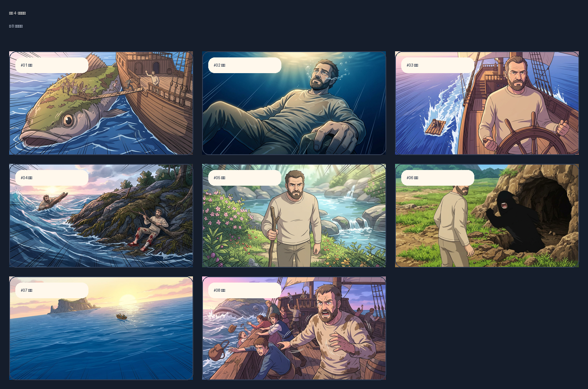

# FilmIt Pipeline

FilmIt Pipeline 是一套给小说影视化和 AI 漫剧制作用的工作流系统，不是单次调用模型的 demo。它把 `PDF/TXT -> 切章 -> 剧本 -> 分镜 -> 出图 -> 视频 -> 配音/字幕 -> 导出` 拆成 8 个可审阅、可回滚、可换模型的步骤，并把中间产物落到本地，方便继续改。

它现在的核心价值很直接：

- 每一步都能看输入、看输出、单独重跑，不是黑盒。
- 可以人工审核、改 prompt、切 provider、只修某一步，不用整条链路重来。
- 图片、视频、字幕、音频都在同一个工作台里，不是零散脚本。
- 产物全部落盘，适合继续做人工精修、拼接和版本管理。

## 看效果

《辛巴达航海》第 4 章分镜示例：



真实视频片段示例：

- [辛巴达航海 · 第 4 章单镜头 Demo（MP4）](docs/assets/sinbad-shot-demo.mp4)

## 10 分钟跑起来

前提：

- Docker Desktop
- 一台能跑 Docker Compose 的 macOS 或 Linux 机器
- 至少 10 GB 可用磁盘空间

第一轮启动只需要先改一个关键配置：`N2V_GENERATED_DIR`。

```bash
cp .env.example .env
```

打开 `.env`，至少确认这一项：

```bash
N2V_GENERATED_DIR=/absolute/path/on/your/machine/filmit-data
```

它必须是你自己机器上的绝对路径，而且 Docker 要能写进去。比如：

```bash
N2V_GENERATED_DIR=/Users/alice/filmit-data
```

如果你现在只是想先把界面和流程跑通，不想立刻花 API 费用，下面这些 key 可以先留空：

- `N2V_OPENAI_API_KEY`
- `N2V_OPENROUTER_API_KEY`
- `N2V_VOLCENGINE_LAS_API_KEY`

系统会尽量回退到 mock provider，让你先验证工作台、审核流和本地落盘。

启动：

```bash
docker compose up -d --build
```

启动后访问：

- Web: `http://localhost:3000`
- API: `http://localhost:8000`
- API Docs: `http://localhost:8000/docs`

## 第一次进入后怎么验证

推荐按这个顺序：

1. 先创建一个空项目，确认前后端都能联通。
2. 导入本地 `TXT` 或 `PDF`，先跑文本链路。
3. 如果你配了真实 key，再去测试图片或视频步骤。
4. 在项目页试一次“改 prompt / 切模型 / 只重跑某一步”。

第 4 步就是这个项目和普通生成 demo 的差别所在。

## 真实模型怎么配

最常见的组合：

- 想先把文本链路跑顺：配 `N2V_OPENROUTER_API_KEY`
- 想测图片、视频、TTS：配 `N2V_OPENAI_API_KEY`
- 想测 `Seedance` 视频链路：配 `N2V_VOLCENGINE_LAS_API_KEY`

当前代码里已经接入这些方向：

- 文本推理：`OpenRouter`、`OpenAI`
- 图片生成：`OpenAI`
- 视频生成：`OpenAI / Sora`、`Volcengine / Seedance`
- 配音：`OpenAI TTS`、`Edge TTS`

如果 key 留空，对应 provider 会退回 mock 或不可用状态，方便先做流程开发。

## 项目结构

```text
apps/
  api/     FastAPI 后端
  web/     Next.js 前端
workers/   Celery worker
libs/      Provider / Workflow / Consistency 共享库
docs/      架构和演示材料
```

所有生成文件都会落到 `N2V_GENERATED_DIR`，常见目录包括：

- `sources/`
- `chapters/`
- `scripts/`
- `storyboards/`
- `videos/`
- `audio/`
- `exports/`

这点很重要：FilmIt 的目标不是“一次生成结束”，而是把每一步产物留下来，方便团队继续修。

## 现在已经能做什么

- 导入 `PDF/TXT` 小说并拆分章节
- 自动生成章节剧本和分镜
- 在浏览器里审核每一步输出
- 改 prompt 后重跑单步
- 切换 provider / model 后重跑
- 对比分镜版本并回滚
- 预览本地生成的图片和视频
- 跑通 `storyboard -> segment_video` 的真实媒体链路

## 常见问题

`docker compose` 起不来：

- 先检查 `.env` 里的 `N2V_GENERATED_DIR` 是否是绝对路径
- 再检查这个目录是否存在、是否有写权限
- 如果拉镜像很慢，再去改 `N2V_REGISTRY_MIRROR`

页面能打开，但媒体预览失败：

- 大多数情况是 `N2V_GENERATED_DIR` 没设对
- 现在的 `docker-compose.yml` 会按你的 `N2V_GENERATED_DIR` 绑定挂载，不再写死作者机器路径

只想做前端或流程开发，不想真调模型：

- 把 provider key 留空即可
- 先用 mock 跑通界面、状态流转和审核操作

## 浏览器回归测试

```bash
cd apps/web
npm run playwright:install
npm run playwright:test
```

如果你想可视化看一遍：

```bash
cd apps/web
npm run playwright:test:headed
```

## 相关文档

- 架构基线：[docs/architecture-v1.1.0.md](docs/architecture-v1.1.0.md)
- Agent 化规划：[docs/filmit-agentization-implementation-plan.md](docs/filmit-agentization-implementation-plan.md)
