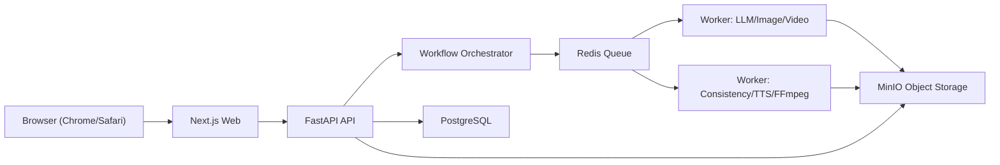

# FilmIt Pipeline 技术架构文档 v1.1.0

- 文档版本: `1.1.0`
- 生效日期: `2026-03-08`
- 适用范围: `macOS 本地部署 + 浏览器访问（Chrome/Safari）`
- 目标产物: 从 `PDF/TXT 小说` 自动生成 `可指定时长` 的成片视频，支持人工闭环和多模型自由组合。

## 1. 目标与设计原则

### 1.1 核心目标

1. 输入小说文件（`pdf` / `txt`），输出指定总时长的视频（`mp4`）。
2. 覆盖全流程：分段、剧情抽取、剧本分镜、文生图、图生视频、拼接、字幕、配音。
3. 每个步骤都支持人工干预，形成可审可改可回滚的闭环。
4. 每一步可切换不同 AI 模型组合，不绑定单一供应商。
5. 在 macOS 本地一键运行，通过浏览器进行配置、执行和审核。

### 1.2 关键设计原则

1. 一致性优先：角色、场景、动作、时间线在跨镜头和跨段落中保持连贯。
2. 人机协同：自动生成为默认路径，人工审核为强制关口。
3. 可插拔模型：统一适配层屏蔽不同厂商 API 差异。
4. 可追溯：每次生成、重跑、人工编辑都保留版本与差异。
5. 可运维：任务状态、失败原因、成本和时延可观测。

## 2. 业务流程与人工闭环

## 2.1 标准流程（8 步 + 1 个内部预处理阶段）

1. 小说导入与解析（PDF/TXT）。
2. 章节切分与上下文压缩。
3. Story Bible 前置安全预处理（敏感表达改写、文本锚点安全化，内部阶段）。
4. 冲突场景/情节转折识别，生成剧本和分镜。
5. 分镜细化（人物形象、场景、动作、对白）。
6. 分镜文生图。
7. 一致性检测与回炉修复。
8. 图/文生视频，按分镜生成段落视频；最终由成片输出完成拼接、字幕、配音与导出。

说明：

- 前端仍维持 `8` 个主步骤，不单独展示内部安全预处理步骤。
- Story Bible 构建必须在安全预处理之后执行，避免人物/场景/物品参考图因敏感表述直接失败。

## 2.1.1 v1.1.0 实施顺序

1. 第一批：`影视提示词工程增强`、`分镜图禁字硬约束`、`Story Bible 前置安全预处理`。
2. 第二批：`Story Bible 资产拆分为人物/场景/物品三套参考体系`。
3. 第三批：`segment_video` 从静态停留升级为真实图生视频/首尾帧驱动的视频生成链路。

## 2.2 每步统一审核动作

每一步 UI 固定提供以下四个动作：

1. `通过`
2. `编辑后继续`
3. `修改提示词或设定后重新生成`
4. `切换模型重跑`

### 2.3 审核动作约束

1. 作用域：`当前镜头`、`当前章节`、`当前步骤全部待处理项`。
2. 提示词分层：
   - `系统基线提示词（锁定）`
   - `任务提示词（可编辑）`
3. 可编辑设定：模型参数（如 `seed`、风格、时长、运动强度、阈值、音色等）。
4. 每次重跑写入版本快照：`prompt diff + params diff + 结果版本`。

## 3. 系统架构

## 3.1 逻辑组件

1. Web 前端（Next.js）
   - 项目管理、模型配置、步骤审核、时间线编辑、导出。
2. API 服务（FastAPI）
   - 提供 REST API、权限校验、任务提交、状态查询。
3. 工作流编排器（Orchestrator）
   - 负责 DAG 步骤调度、状态流转、重试与依赖控制。
4. Worker 集群（Celery Workers）
   - 执行 LLM、图像、视频、TTS、FFmpeg 等耗时任务。
5. 模型适配层（Provider Adapters）
   - 统一调用主流模型 API，屏蔽请求/响应差异。
6. 一致性引擎（Consistency Engine）
   - 人物/场景/动作连续性评分，输出修复建议。
7. 存储层
   - PostgreSQL（元数据）
   - MinIO（素材与中间产物）
   - Redis（队列与缓存）

## 3.2 部署拓扑（本地）



## 3.3 技术栈（v1.1.0）

1. 前端：`Next.js 15 + TypeScript + Tailwind + Zustand`
2. 后端：`FastAPI + Pydantic + SQLAlchemy`
3. 队列：`Celery + Redis`
4. 数据库：`PostgreSQL 16`
5. 对象存储：`MinIO`
6. 媒体处理：`FFmpeg`
7. 部署：`Docker Compose`（macOS 本地）

## 4. 工作流与状态机

## 4.1 顶层状态

`DRAFT -> RUNNING -> REVIEW_REQUIRED -> APPROVED -> RENDERING -> COMPLETED`

失败分支：`RUNNING/RENDERING -> FAILED`（可重试、可回滚、可切模型）

## 4.2 步骤状态

`PENDING -> GENERATING -> REVIEW_REQUIRED -> APPROVED`

异常/修复分支：

- `REVIEW_REQUIRED -> REWORK_REQUESTED -> GENERATING`
- `GENERATING -> FAILED -> RETRYING | BLOCKED`

## 4.3 人工闭环门禁

每个步骤默认必须进入 `REVIEW_REQUIRED`，只有点击 `通过` 才可推进到下一步；支持配置“低风险步骤自动通过”，但 v1.1.0 默认关闭。

## 5. 一致性设计（重点）

## 5.1 Story Bible（故事圣经）

项目创建时生成并持续维护：

1. 角色卡：姓名、外貌锚点、服装道具、语气、禁忌。
2. 场景卡：地点、风格、时代、天气/光照、不可变元素。
3. 物品卡：关键道具、材质、尺寸、磨损状态、章节归属。
4. 时间线：章节时间顺序、角色状态迁移。
5. 视觉基线：镜头语言、色彩基调、构图偏好。
6. 安全改写记录：原始风险短语、改写结果、适用资产类型。

v1.1.0 资产拆分要求：

1. 人物资产与场景资产必须彻底分离，不允许人物身份图带入具体场景背景。
2. 人物资产目标形态：
   - 正面、左侧、右侧、背面四视图
   - 纯白或纯浅灰背景
   - 中性站姿
   - 无字幕、无水印、无场景叙事
3. 场景资产目标形态：
   - 同一场景多角度参考
   - 不同光照条件参考
   - 以空间布局和光源逻辑为主，不以人物表演为主
4. 重要物品资产目标形态：
   - 独立物品多视图图库
   - 中性背景
   - 便于后续镜头和视频步骤保持 continuity

## 5.2 首尾帧桥接（新增）

跨章节与跨片段一致性必须支持 `first/last frame bridging`：

1. 每章节在分镜阶段明确标记：
   - `first_frame_candidate`
   - `last_frame_candidate`
   - `bridge_subjects`
2. 每章节在视频阶段生成连续性包：
   - 上一章节末帧参考
   - 当前章节首帧参考
   - 当前章节末帧目标
   - 下一章节首帧预期锚点（若可用）
3. `segment_video` 调用优先使用首尾帧参考图与文本锚点共同约束，而不是只依赖单张 Story Bible 参考图。
4. 一致性检查需要区分：
   - 章节内镜头一致性
   - 章节间首尾帧连续性
   - 全局人物/场景/物品 continuity

## 5.3 Shot Graph（镜头图）

每个镜头记录：

1. 输入依赖：上一个镜头的角色状态和场景状态。
2. 目标状态：本镜头人物动作、情绪、关键道具。
3. 连续性约束：服装一致、空间一致、动作可达。

## 5.4 自动检测维度

1. 角色一致性：脸部特征、发型、服装、体态。
2. 场景一致性：背景结构、光照方向、主色调。
3. 动作一致性：动作起止合理、跨镜头衔接自然。
4. 叙事一致性：对白与剧情阶段不冲突。
5. 文字污染检测：分镜图与 Story Bible 参考图不得出现可读字幕、台词、logo、水印。
6. 首尾帧检测：章节边界处主体、镜头朝向、空间关系是否可衔接。

## 5.5 评分与回炉

1. 每镜头输出一致性分数：`0~100`。
2. 阈值默认 `75`，低于阈值自动打回 `REWORK_REQUESTED`。
3. 回炉策略优先级：
   - 优先局部重生成（单镜头）
   - 再章节级重生成
   - 最后步骤级重跑
4. 若失败原因为 `文字污染`，必须直接回退到分镜出图，禁止带字图继续进入校核或视频步骤。
5. 若失败原因为 `章节边界不连续`，优先触发 `首尾帧桥接重跑`，而不是全章无差别重跑。

## 6. 多模型适配架构（重点）

## 6.1 统一 Provider 接口

```ts
export type StepType =
  | "chunk"
  | "script"
  | "shot_detail"
  | "image"
  | "consistency"
  | "video"
  | "subtitle"
  | "tts";

export interface ProviderRequest {
  step: StepType;
  model: string;
  input: Record<string, unknown>;
  prompt?: string;
  params?: Record<string, unknown>;
}

export interface ProviderResponse {
  output: Record<string, unknown>;
  usage?: { inputTokens?: number; outputTokens?: number; seconds?: number };
  raw?: unknown;
}

export interface ProviderAdapter {
  name(): string;
  supports(step: StepType, model: string): boolean;
  invoke(req: ProviderRequest): Promise<ProviderResponse>;
  estimateCost?(req: ProviderRequest): Promise<number>;
  healthCheck(): Promise<boolean>;
}
```

## 6.2 步骤到模型池映射（示例）

```yaml
step_model_pool:
  chunk:
    - gemini-2.5-flash-lite
    - deepseek-chat
  script:
    - claude-sonnet-4
    - gpt-5
    - gemini-2.5-pro
  image:
    - imagen-4
    - gpt-image-1
    - runway-gen4-image
  video:
    - veo-3.1
    - sora
    - runway-gen4-turbo
  tts:
    - gpt-4o-mini-tts
    - elevenlabs-multilingual-v2
    - azure-neural-tts
```

## 6.3 参数归一化

统一参数字典，适配层内部做映射：

1. 文本模型：`temperature`、`top_p`、`max_tokens`
2. 图像模型：`seed`、`style`、`aspect_ratio`、`negative_prompt`
3. 视频模型：`duration_sec`、`fps`、`camera_motion`、`strength`
4. 语音模型：`voice_id`、`speed`、`emotion`、`sample_rate`
5. 影视控制参数：
   - `director_style`
   - `real_light_source_strategy`
   - `skin_texture_level`
   - `shot_distance_profile`
   - `lens_package`
   - `camera_movement_style`
   - `continuity_method`
   - `forbid_readable_text`

## 7. 数据模型（PostgreSQL）

## 7.1 核心表

1. `projects`
   - 基本信息、目标时长、输入输出路径、全局风格。
2. `source_documents`
   - 原始文件、解析状态、页码映射。
3. `chapter_chunks`
   - 分段文本、边界信息、上下文重叠区。
4. `story_beats`
   - 冲突、转折、剧情节点。
5. `shots`
   - 分镜定义、镜头顺序、时长预算、角色场景引用。
6. `assets`
   - 中间产物索引（图像、视频、音频、字幕）。
7. `pipeline_steps`
   - 步骤执行状态、耗时、成本、错误信息。
8. `review_actions`
   - 人工操作日志（四类按钮动作 + 备注）。
9. `prompt_versions`
   - 系统基线与任务提示词版本、diff、回滚标记。
10. `model_runs`
    - 单次模型调用请求摘要、响应摘要、usage、费用估算。

## 7.2 建议字段（节选）

`pipeline_steps`：

- `id`、`project_id`、`step_name`、`status`
- `input_ref`、`output_ref`
- `model_provider`、`model_name`
- `attempt`、`started_at`、`finished_at`
- `error_code`、`error_message`

`review_actions`：

- `id`、`project_id`、`step_id`、`scope_type`
- `action_type`（`approve`/`edit_continue`/`edit_prompt_regen`/`switch_model_rerun`）
- `editor_payload`（JSON）
- `created_by`、`created_at`

`prompt_versions`：

- `id`、`project_id`、`step_name`
- `system_prompt`、`task_prompt`
- `parent_version_id`、`diff_patch`
- `is_active`、`created_at`

## 8. API 设计（FastAPI）

## 8.1 项目与配置

1. `POST /api/v1/projects`
2. `GET /api/v1/projects/{project_id}`
3. `PATCH /api/v1/projects/{project_id}`
4. `POST /api/v1/projects/{project_id}/model-bindings`
5. `GET /api/v1/providers/models`

## 8.2 任务执行

1. `POST /api/v1/projects/{project_id}/run`
2. `POST /api/v1/projects/{project_id}/steps/{step_name}/run`
3. `GET /api/v1/projects/{project_id}/steps`
4. `GET /api/v1/projects/{project_id}/timeline`

## 8.3 人工闭环

1. `POST /api/v1/projects/{project_id}/steps/{step_id}/approve`
2. `POST /api/v1/projects/{project_id}/steps/{step_id}/edit-continue`
3. `POST /api/v1/projects/{project_id}/steps/{step_id}/edit-prompt-regenerate`
4. `POST /api/v1/projects/{project_id}/steps/{step_id}/switch-model-rerun`

## 8.4 产物与导出

1. `GET /api/v1/projects/{project_id}/assets`
2. `POST /api/v1/projects/{project_id}/render/final`
3. `GET /api/v1/projects/{project_id}/exports/{export_id}`

## 9. 前端信息架构

## 9.1 页面结构

1. 项目列表页
2. 项目工作台
3. 模型配置页
4. 步骤审核页
5. 时间线编辑页
6. 导出页

## 9.2 步骤审核页关键组件

1. 左侧：步骤队列和状态标签。
2. 中央：当前步骤产物预览（文本/图像/视频）。
3. 右侧：可编辑提示词和参数面板。
4. 底部：四个统一动作按钮。
5. 版本对比弹窗：A/B 结果与 diff 对照。
6. 风格控制面板：
   - 导演风格预设
   - 真实光源管理
   - 肌肤纹理级别
   - 近中远景比例
   - 镜头焦段倾向
   - 运镜风格
   - 首尾帧桥接开关
   - 分镜禁字硬约束开关（默认强制开启）

## 9.3 分镜与视频步骤的硬约束提示

1. `storyboard_image` 页面必须显式展示：`禁止出现字幕/文字/水印/Logo`。
2. `segment_video` 页面必须显式展示：`必须输出真实运动视频，静态停留不视为通过`。
3. `consistency_check` 页面必须显式展示：`章节边界首尾帧连续性评分`。

## 10. 媒体处理规范

## 10.1 时间预算

1. 目标总时长 `T`。
2. 根据剧情权重将 `T` 分配到章节和镜头。
3. 镜头最小时长建议 `2.5s`，最大建议 `12s`。

## 10.2 编码参数（默认）

1. 分辨率：`1920x1080`
2. 帧率：`24 fps`
3. 编码：`H.264 + AAC`
4. 容器：`mp4`

## 10.3 字幕与配音

1. 字幕格式：`srt`（同时可导出 `vtt`）。
2. 字幕来源：对白脚本 + 强制时间轴对齐。
3. 配音策略：旁白轨、角色轨分离后混音。

## 10.4 分镜图生成约束（新增）

1. 任何分镜图都不得出现可读文字：
   - `no text`
   - `no subtitles`
   - `no captions`
   - `no watermark`
   - `no logo`
2. 生成后必须执行 OCR / 视觉文字检测。
3. 检测命中文字后，必须自动加入修正提示词并重试，仍失败则标记 `FAILED`。

## 10.5 视频生成约束（新增）

1. `segment_video` 产物必须是真实运动视频，不能用静态分镜停留替代。
2. 视频提示词必须同时包含：
   - 剧情动作描述
   - 运镜描述
   - 光源逻辑
   - 人物/场景/物品 continuity 约束
   - 首尾帧桥接约束
3. 对支持参考图的模型，应同时传入：
   - 当前章节首帧
   - 当前章节末帧
   - 相邻章节桥接帧（若可用）
4. 对暂不支持多参考图的模型，至少传入首帧参考，并将末帧目标写入强约束 prompt。

## 11. 错误处理与重试策略

1. 网络错误：指数退避重试（`1s/3s/9s`）。
2. 限流错误：降速 + 排队，必要时切换备用模型。
3. 结果不合规：进入 `REWORK_REQUESTED`，不自动推进。
4. 媒体处理失败：保留中间产物，支持从失败节点续跑。

## 12. 安全与密钥管理

1. API Key 加密存储（建议 `AES-GCM`）。
2. 密钥只在后端使用，前端永不直连第三方模型。
3. 敏感日志脱敏（key、用户隐私文本）。
4. 本地部署默认单用户，保留扩展到多用户 RBAC 的接口字段。
5. Story Bible 参考图生成前必须做敏感表达拦截与改写，优先保留身份/空间信息，移除裸露、露骨性暗示、显式血腥等高风险视觉表述。

## 13. 可观测性

1. 指标：
   - 每步耗时、成功率、平均重跑次数、人工介入率。
2. 成本：
   - 按 `project/step/model` 统计 token、秒数、估算费用。
3. 质量：
   - 一致性评分趋势、打回率、最终导出通过率。
4. 日志：
   - 请求链路 ID + 步骤 ID + 版本 ID 可追踪。

## 14. v1.1.0 交付边界

### 14.1 In Scope

1. PDF/TXT 导入与解析。
2. 8 步全流程可运行。
3. 四按钮人工闭环。
4. 多模型切换与重跑。
5. 本地浏览器管理界面。
6. 第一批增强项：
   - Story Bible 前置敏感预处理
   - 影视专业提示词控制字段
   - 分镜禁字硬约束
   - 首尾帧桥接数据结构与提示词支持

### 14.2 Out of Scope

1. 云端多租户 SaaS。
2. 实时协作编辑。
3. 移动端适配优化。
4. 第二批增强项：
   - Story Bible 人物四视图 / 场景多角度 / 物品图库完整生产线
   - 真正的图生视频替换静态停留链路

## 15. 推荐目录结构（仓库）

```text
filmit-pipeline/
  apps/
    web/                # Next.js 前端
    api/                # FastAPI 后端
  workers/
    llm_worker/
    media_worker/
  libs/
    provider_adapters/
    workflow_engine/
    consistency_engine/
    prompt_templates/
  infra/
    docker/
    compose/
  docs/
    architecture-v1.1.0.md
```

## 16. 验收标准（v1.1.0）

1. 给定任意合法 `pdf/txt`，可生成完整视频文件。
2. 任意步骤可执行四按钮动作，并正确记录审计日志。
3. 任意步骤可切换至少 2 个不同模型并成功重跑。
4. 一致性评分低于阈值的镜头会被自动拦截，不允许直接导出。
5. 在 macOS 本地通过浏览器完成项目创建、执行、审核、导出的全流程。
6. Story Bible 参考资产生成前会自动完成敏感表达改写，并留下审计记录。
7. 分镜图 OCR 不得检出可读字幕/水印/Logo。
8. 视频步骤的 prompt 中必须带有首尾帧桥接约束，且章节边界连续性进入评分维度。

---

本版本文档为工程落地基线；后续如进入 `v1.1.x`，建议优先扩展“人物/场景/物品三套资产库落地”和“真实图生视频链路替换静态停留”。
