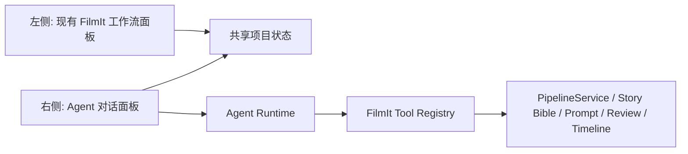

# FilmIt Agent 化改造实施细则

- 文档版本: `v0.1`
- 起草日期: `2026-03-15`
- 适用范围: `FilmIt Pipeline 当前工作树`
- 目标: 在保留现有左侧手工工作流的前提下，为项目页增加一个右侧 Agent 对话工作台，使用户可以直接用自然语言查询、诊断、规划和驱动 FilmIt 后端执行操作。

## 0. 已确认决策

以下策略已于 `2026-03-15` 由用户明确确认，后续实现默认按此执行:

1. Agent 写操作必须让用户充分知情并明确授权确认。
2. Agent 模型与 FilmIt 流水线模型分离。
3. 首期 RAG 采用轻量本地索引，先跑通完整链路。
4. 单项目首期只启用单对话，但接口设计需预留多对话扩展。
5. 右侧 Agent 面板由用户决定是否开启，并保留显著的开启/关闭按钮。

## 1. 背景与目标重述

过去半个月的实际协作模式已经说明了一个事实:

1. FilmIt 现在已经不是纯“按钮式流水线工具”，而是“按钮式流水线 + 人工口头下达修复指令”的混合系统。
2. 用户的真实诉求不是让 AI 替代工作流，而是让 AI 成为工作流里的另一种操作入口。
3. 右侧对话框的价值不在“聊天”，而在于:
   - 理解当前项目状态
   - 自动收集上下文
   - 将自然语言转成 FilmIt 内部动作
   - 保留审计、回滚、提示词版本和模型切换能力

因此本次改造的正确方向不是“做一个通用 OpenClaw 克隆”，而是做一个 `FilmIt 专用 Agent Runtime`:

1. 左侧仍保留现有工作流 UI 和人工审核动作。
2. 右侧新增项目专属 Agent 面板。
3. Agent 本质上是 FilmIt 的第二操作界面，调用的是 FilmIt 自己的内部能力和工具，而不是无约束外部代理。

## 2. 当前仓库现状评估

结合当前代码，FilmIt 已经具备 Agent 化的基础，只是还没有“会话层”和“工具层”。

### 2.1 已有可复用能力

后端已具备这些基础设施:

1. `Project / PipelineStep / ChapterChunk / Shot / Asset / StoryboardVersion / ReviewAction / PromptVersion / ModelRun` 等核心模型已经存在。
2. `PipelineService` 已经封装了步骤执行、批量章节运行、人工审核、重跑、模型切换、Story Bible 重建、一致性返工等关键能力。
3. API 路由已经暴露了大部分手工动作:
   - 运行项目/步骤
   - 通过
   - 编辑后继续
   - 修改提示词重生成
   - 切换模型重跑
   - Story Bible 重建
   - Storyboard 版本切换
4. `style_profile.story_bible` 已经具备项目级故事圣经与角色/场景参考图承载能力。
5. `PromptVersion` 与 `ReviewAction` 已经构成天然审计链。

### 2.2 当前结构瓶颈

Agent 化之前，仓库有几个明显约束:

1. 前端项目页目前集中在单文件 `apps/web/app/projects/[id]/page.tsx`，规模已经达到 `2556` 行，不适合继续硬塞对话框逻辑。
2. 后端 `apps/api/app/services/pipeline_service.py` 已经达到 `6927` 行，不适合继续把 Agent 逻辑混在其中。
3. 当前系统没有会话对象、消息对象、工具调用日志对象、上下文压缩对象。
4. 当前 Story Bible 是“项目状态的一部分”，还不是“可检索记忆层的一部分”。
5. 目前的模型调用以“单步流水线执行”为中心，还没有“多轮对话 + 计划 + 工具调用 + 中间观察”的 Agent 回路。

### 2.3 结论

FilmIt 不是从零做 Agent，而是:

1. 复用现有 `PipelineService` 作为领域执行引擎。
2. 在其外再加一层 `Agent Session + Tool Runtime + Context Builder + Memory/RAG`。
3. 前端新增右侧对话工作台，并把现有页面拆组件。

## 3. 改造后的产品形态

## 3.1 目标交互形态

项目详情页改为双工作区:



### 3.2 用户可做的事

用户在右侧可以直接说:

1. “帮我看看为什么这个章节卡在分镜校核。”
2. “把第 3 章的 shot detail 重跑，提示词强调人物年龄感一致。”
3. “这个 story bible 不准，重新抽一版角色卡并保留现有风格。”
4. “列出当前失败章节，并按优先级给我修复建议。”
5. “把所有 `REWORK_REQUESTED` 的 consistency 章节批量修复一轮。”
6. “先别执行，给我一个修复计划。”

### 3.3 不应在首期支持的事

首期不建议让 Agent:

1. 拥有任意 shell 执行能力。
2. 直接绕过 FilmIt 的审计体系写数据库。
3. 自由访问所有外部网络资源。
4. 在未确认前执行高成本批量视频重跑。
5. 变成通用“桌面代理”。

结论: 首期是 `项目内专用代理`，不是 `万能 Agent`。

## 4. 总体设计原则

1. `同源状态`: 左侧手工操作和右侧 Agent 操作必须共用同一套项目状态与审计链。
2. `工具优先`: Agent 不直接拼接业务 SQL，不直接自行修改文件，而是调用受控工具。
3. `读写分级`: 查询类工具自动执行，写操作和高成本操作按策略审批。
4. `上下文分层`: 不把整个项目状态一次性塞给模型，而是按需构造上下文。
5. `压缩优先`: 长会话必须做 compaction 和 tool-result pruning。
6. `最小必要复杂度`: 先做 FilmIt 原生工具注册表，再考虑 MCP 扩展，不先引入一个超重框架。

## 5. 推荐总体方案

## 5.1 方案对比

### 方案 A: 轻量 FilmIt 原生 Agent 层

做法:

1. 后端新增 `agent` 模块。
2. 自己维护 session/message/run/tool-call/memory。
3. LLM 通过 OpenAI Responses API 或等价文本推理接口做工具调用。
4. 工具直接映射到 `PipelineService` 现有能力。

优点:

1. 与现有代码最贴合。
2. 审计和权限边界可控。
3. 易于分阶段落地。
4. 不需要先把 FilmIt 重构成通用 agent 平台。

缺点:

1. 需要自己实现会话管理、压缩和工具调度。
2. 需要自己做前端流式事件设计。

### 方案 B: 引入重量级 Agent 编排框架

做法:

1. 用外部 Agent 框架承接 session、planner、tool loop。
2. FilmIt 作为工具提供方。

优点:

1. 某些能力来得快。
2. tracing/graph 编排可能更成熟。

缺点:

1. 增加额外抽象层。
2. 很容易和现有 `PipelineService` 的状态机冲突。
3. 首期会被框架适配工作拖慢。

### 方案 C: 做成完整 MCP-first 平台

做法:

1. 先把 FilmIt 所有能力抽成 MCP server。
2. Agent 只通过 MCP 调用。

优点:

1. 长期扩展性好。
2. 更容易与外部工具生态互通。

缺点:

1. 对 FilmIt 当前阶段明显过重。
2. MCP 是扩展面，不应成为首期落地阻塞项。

## 5.2 推荐结论

推荐采用 `方案 A，兼容未来 MCP 化`:

1. 首期先做 FilmIt 原生 Agent Runtime。
2. Tool Registry 的接口设计从一开始就按 MCP 风格组织:
   - 明确 tool 名称
   - JSON schema 入参
   - 结构化结果
   - 可审计调用日志
3. 二期再把部分工具包装成 MCP server 或接入远程 MCP。

## 6. 目标架构

## 6.1 后端模块拆分

建议新增以下模块:

```text
apps/api/app/agent/
  __init__.py
  schemas.py              # Agent 会话/消息/运行/工具调用 schema
  service.py              # AgentSessionService
  runtime.py              # LLM loop, tool loop, streaming
  registry.py             # Tool registry
  tools/
    project_tools.py
    chapter_tools.py
    step_tools.py
    story_bible_tools.py
    prompt_tools.py
  context_builder.py      # 上下文分层装配
  compaction.py           # 会话压缩
  memory_service.py       # durable memory
  retrieval_service.py    # 项目 RAG / 召回
  approvals.py            # 写操作审批策略
  events.py               # SSE/WebSocket 事件
```

API 层新增:

```text
apps/api/app/api/agent_routes.py
apps/api/app/schemas/agent.py
```

### 6.2 关键原则

1. `PipelineService` 继续负责领域动作执行。
2. `Agent runtime` 只负责理解指令、规划、调用工具、整理回复。
3. Agent 不通过 HTTP 回调自己，而是直接调用 Python service。
4. 现有 REST API 继续服务左侧 UI；右侧 UI 走新的 Agent API。

## 6.3 前端模块拆分

建议把项目页先拆出:

```text
apps/web/app/projects/[id]/
  page.tsx
  components/
    project-shell.tsx
    workflow-pane.tsx
    chapter-list.tsx
    step-action-panel.tsx
    agent-panel.tsx
    agent-message-list.tsx
    agent-input-box.tsx
    agent-tool-call-card.tsx
    agent-context-inspector.tsx
```

推荐布局:

1. 左侧 `65%~72%`: 现有工作流与章节/步骤面板。
2. 右侧 `28%~35%`: 固定宽度可折叠 Agent 面板。
3. 移动端改成底部抽屉，不做并排双栏。

## 7. 数据模型设计

## 7.1 新增表

建议新增以下持久化对象:

### `agent_sessions`

字段建议:

1. `id`
2. `project_id`
3. `title`
4. `status` (`ACTIVE / ARCHIVED / BLOCKED`)
5. `agent_profile`
6. `last_compacted_at`
7. `last_memory_flush_at`
8. `created_at / updated_at`

### `agent_messages`

字段建议:

1. `id`
2. `session_id`
3. `role` (`system / user / assistant / tool / summary`)
4. `content_text`
5. `content_json`
6. `token_estimate`
7. `visibility` (`visible / hidden`)
8. `created_at`

说明:

1. `summary` 类型用于 compaction 之后替换旧对话块。
2. 隐藏消息可承载 memory flush 或内部系统注入提示。

### `agent_runs`

字段建议:

1. `id`
2. `session_id`
3. `project_id`
4. `status` (`QUEUED / RUNNING / WAITING_APPROVAL / COMPLETED / FAILED / CANCELLED`)
5. `model_provider`
6. `model_name`
7. `run_mode` (`chat / plan / execute / memory_flush / compaction`)
8. `input_message_id`
9. `output_message_id`
10. `error_message`
11. `started_at / finished_at`

### `agent_tool_calls`

字段建议:

1. `id`
2. `run_id`
3. `session_id`
4. `tool_name`
5. `call_status` (`PLANNED / RUNNING / SUCCEEDED / FAILED / REQUIRES_APPROVAL / SKIPPED`)
6. `args_json`
7. `result_summary`
8. `result_json`
9. `approval_policy`
10. `linked_review_action_id`
11. `started_at / finished_at`

### `agent_memories`

字段建议:

1. `id`
2. `project_id`
3. `session_id` 可空
4. `memory_scope` (`project / session / chapter / style / troubleshooting`)
5. `title`
6. `content`
7. `importance`
8. `source_type`
9. `source_ref`
10. `created_at / updated_at`

### `agent_knowledge_chunks`

如果要自建 RAG 索引，建议有一层统一 chunk 清单:

1. `id`
2. `project_id`
3. `chunk_type` (`source / chapter / story_bible / prompt / review / run_log / asset_caption / memory`)
4. `source_ref`
5. `chapter_id` 可空
6. `step_name` 可空
7. `content`
8. `content_hash`
9. `meta_json`
10. `embedding_status`
11. `updated_at`

## 7.2 对现有表的增强建议

### `review_actions`

建议增加:

1. `initiator_type` (`human / agent / system`)
2. `initiator_session_id`
3. `initiator_run_id`

这样所有右侧 Agent 发起的动作仍然可回收到既有审计链。

### `projects`

建议增加:

1. `agent_profile` JSON
2. `agent_last_summary`
3. `agent_last_health_status`

用于保存项目级 Agent 配置与摘要。

## 8. Tool Registry 设计

## 8.1 工具分层

### A. 读工具

自动执行，无需确认:

1. `get_project_overview`
2. `list_project_steps`
3. `list_project_chapters`
4. `get_selected_chapter_context`
5. `get_story_bible`
6. `list_failed_or_blocked_items`
7. `get_step_execution_history`
8. `get_prompt_versions`
9. `get_storyboard_versions`
10. `search_project_knowledge`

### B. 低风险写工具

默认可自动执行，但要保留可配置审批:

1. `approve_step`
2. `approve_review_required_consistency_chapters`
3. `rebuild_story_bible`
4. `select_storyboard_version`
5. `edit_continue_text_step`

### C. 中高风险写工具

默认需要确认:

1. `run_step`
2. `run_step_for_all_chapters`
3. `edit_prompt_and_regenerate`
4. `switch_model_and_rerun`
5. `regenerate_rework_requested_consistency_chapters`
6. `update_project_style_profile`

### D. 禁止首期开放的工具

1. 任意 SQL
2. 任意文件系统写入
3. 任意外部网址抓取
4. 任意 shell

## 8.2 工具实现原则

1. 工具结果必须结构化，不能只返回大段文本。
2. 工具结果应有短摘要字段，供对话 UI 和 compaction 使用。
3. 工具结果应有可选 `follow_up_hints`，告诉模型接下来常见动作。
4. 所有写工具必须把实际业务变更委托给 `PipelineService`。

## 8.3 工具入参与返回风格示例

```json
{
  "tool_name": "edit_prompt_and_regenerate",
  "args": {
    "project_id": "xxx",
    "step_name": "shot_detailing",
    "chapter_id": "yyy",
    "system_prompt": "可选",
    "task_prompt": "强调人物年龄感、服装、道具一致性",
    "params": {
      "temperature": 0.2
    }
  }
}
```

返回:

```json
{
  "ok": true,
  "summary": "已对第 3 章 shot_detailing 更新提示词并重跑",
  "review_action_id": "ra_123",
  "step_status": "REVIEW_REQUIRED",
  "chapter_status": "REVIEW_REQUIRED"
}
```

## 9. Agent Runtime 设计

## 9.1 核心回路

推荐采用以下单回合执行模型:

1. 用户发消息。
2. 后端创建 `agent_run`。
3. `ContextBuilder` 组装最小必要上下文。
4. 模型判断:
   - 直接回答
   - 提出计划
   - 调用一个或多个工具
5. 如果需要写操作且命中审批策略:
   - 生成“待确认动作卡片”
   - run 状态进入 `WAITING_APPROVAL`
6. 工具执行完成后:
   - 记录工具调用日志
   - 更新对话消息
   - 必要时继续下一轮工具调用
7. 输出最终答复。

## 9.2 建议的运行模式

建议把 Agent 行为分成 4 个显式模式:

1. `ask`: 只解释和查询。
2. `plan`: 给出执行计划，不落地。
3. `act`: 执行经批准的工具。
4. `monitor`: 监控某阶段结果并给出修复建议。

默认策略:

1. 用户语句含 “先不要执行 / 给方案 / 先分析” 时进入 `plan`。
2. 用户语句含 “直接处理 / 你帮我改 / 帮我重跑” 时进入 `act`，但仍受审批规则约束。

## 9.3 冲突与并发控制

项目级必须保证:

1. 同一 `project_id` 同时只允许一个写型 `agent_run` 执行。
2. 左侧手工操作优先级高于右侧 Agent 后续自动动作。
3. 如果用户在左侧手工更改了相关步骤状态，Agent run 要检测版本漂移:
   - 提示“状态已变化，正在重新读取上下文”
   - 必要时重新规划

## 10. 上下文管理设计

这是本次改造最关键的部分。

## 10.1 上下文分层

单次 LLM 调用只注入以下 6 层:

1. `系统层`
   - Agent 角色
   - FilmIt 工具边界
   - 审批规则
2. `项目摘要层`
   - 项目名称
   - 目标时长
   - 全局风格
   - 当前进度摘要
3. `工作集层`
   - 当前选中章节
   - 当前选中步骤
   - 最近错误
   - 最近 1~3 个相关工具结果
4. `记忆层`
   - 项目 durable memory
   - 会话摘要
5. `检索层`
   - Story Bible 相关条目
   - 章节文本摘要
   - prompt 变更史
   - recent review actions
6. `最近对话层`
   - 最近若干用户/助手消息

不要直接把所有 chapters / 所有 step output / 所有 asset 元数据一次性塞进去。

## 10.2 建议的 Token 预算

可按比例预算:

1. 系统层: `8%`
2. 项目摘要层: `10%`
3. 工作集层: `22%`
4. 记忆层: `15%`
5. 检索层: `25%`
6. 最近对话层: `20%`

若超限，裁剪顺序建议:

1. 先裁工具长输出
2. 再裁旧对话
3. 再裁检索片段数量
4. 不裁系统层和项目摘要层

## 10.3 会话 Compaction

建议借鉴 OpenClaw 的做法，但简化为 FilmIt 版:

1. 当会话接近上下文窗口时，对旧消息做摘要。
2. 生成 `summary` 类型消息写入数据库。
3. 摘要保留:
   - 已确认的用户目标
   - 已做出的决策
   - 未完成事项
   - 重要工具调用结果
   - 当前风险和待审批动作
4. 旧消息不必删除，可标记为 `compacted=true`。

### FilmIt 版 compaction 与 pruning 的区别

1. `compaction`: 持久化摘要，保留长期连续性。
2. `pruning`: 仅对单次请求裁剪过长工具结果，不改变持久历史。

## 10.4 Tool result pruning

建议只裁剪这类内容:

1. 超长 JSON
2. 大段章节文本原文
3. 大批量章节结果
4. 大量 storyboard/frame 明细

建议保留:

1. 用户消息
2. 助手最终结论
3. 工具摘要
4. 含关键信息的 error message
5. 图片/视频引用卡片的元信息

## 10.5 Memory flush

建议在即将 compaction 前触发一次“静默记忆写入”:

1. 提取 durable facts:
   - 用户偏好的风格约束
   - 该项目常见缺陷模式
   - 角色/场景纠错结论
   - 模型偏好
2. 写入项目 memory。
3. 用户默认不需要看到该轮内部记忆写入。

## 11. 项目记忆与 RAG 设计

## 11.1 记忆层分层

建议把 FilmIt 的知识分成四层:

### 层 1: Structured state

来自数据库的结构化状态:

1. 项目基本信息
2. step 状态
3. chapters 状态图
4. latest prompt version
5. review action

这部分优先直接查库，不需要 embedding。

### 层 2: Durable memory

需要跨会话保存的结论:

1. 用户长期风格偏好
2. 该项目的人设修正规则
3. 场景锚点
4. 经确认的提示词策略
5. 常见失败修复经验

### 层 3: Searchable knowledge

可召回的大文本:

1. 原始小说摘录
2. chapter chunk 摘要
3. story bible 条目
4. consistency 报告
5. model run 摘要
6. prompt diff 摘要
7. asset caption

### 层 4: Ephemeral working set

本轮对话临时上下文:

1. 当前选中章节
2. 当前页面选中步骤
3. 刚执行的工具结果

## 11.2 首期推荐的 RAG 实现

推荐先做 `轻量本地 RAG`:

1. 结构化状态直接查库。
2. 文本检索先用:
   - SQLite/Postgres FTS
   - 可选 embeddings
3. 只对以下对象建索引:
   - `ChapterChunk.content`
   - `style_profile.story_bible`
   - `PromptVersion`
   - `ReviewAction.editor_payload/comment`
   - `ModelRun.request_summary/response_summary`
   - consistency 报告摘要

原因:

1. 这已经覆盖 80% 的诊断问题。
2. 实现成本显著低于引入独立向量数据库。
3. 便于先验证右侧 Agent 的价值。

## 11.3 二期推荐的检索增强

当首期稳定后，可升级为:

1. semantic retrieval
2. MMR 去重
3. recency decay
4. metadata filtering

推荐过滤维度:

1. `project_id`
2. `chapter_id`
3. `step_name`
4. `chunk_type`
5. `status`
6. `updated_at`

推荐排序思路:

`结构化命中 > 精确元数据过滤 > 语义召回 > 时间衰减 > 去重`

## 11.4 Story Bible 在 RAG 中的特殊地位

Story Bible 不应只当作一个 JSON blob。

建议拆成独立 chunk:

1. `character_card`
2. `scene_card`
3. `visual_style`
4. `consistency_guardrail`
5. `reference_digest`

这样用户问“为什么这里人物不一致”时，Agent 可以同时召回:

1. 当前章节/镜头状态
2. 相关人物卡
3. 最近一致性失败原因
4. 对应提示词版本

## 12. MCP 与扩展工具策略

## 12.1 首期建议

首期不强依赖 MCP，但 Tool Registry 要按 MCP 思维设计。

也就是:

1. 每个工具有明确名字。
2. 每个工具有 JSON schema。
3. 每个工具有标准化返回体。
4. 每个工具有审批级别。
5. 每个工具有可观测日志。

## 12.2 二期 MCP 化路线

等首期稳定后，可加一层:

1. `FilmIt MCP Server`
2. 把查询类和安全写类工具暴露出去
3. 允许外部 agent 或远程 control plane 访问

建议 MCP 首批暴露:

1. `get_project_overview`
2. `list_chapters`
3. `get_story_bible`
4. `run_step`
5. `approve_step`
6. `edit_prompt_and_regenerate`

## 12.3 外部 MCP 风险

外部 MCP 能力必须默认关闭或白名单化，避免:

1. 任意文件写入
2. 任意 shell
3. 未授权网络访问
4. 超预算媒体生成

## 13. 前端实施方案

## 13.1 页面结构

推荐项目页拆成三层:

1. `ProjectShell`
   - 拉取项目与 session 基础数据
   - 管理双栏布局
2. `WorkflowPane`
   - 保留现有步骤、章节、动作 UI
3. `AgentPane`
   - 聊天输入
   - 消息流
   - 工具调用卡片
   - 审批卡片
   - 上下文/记忆状态查看器

## 13.2 Agent 面板最小功能

首期 UI 只做这些:

1. 消息列表
2. 输入框
3. “仅分析 / 可执行” 模式切换
4. 工具调用进度条
5. 审批确认卡片
6. 引用来源卡片

先不要做:

1. 多会话复杂标签页
2. 多 agent 协作视图
3. 复杂草稿树
4. 可视化 DAG planner

## 13.3 推荐交互细节

1. 用户输入后立即显示“正在读取项目状态”。
2. 工具调用应逐条流式展示:
   - 读取项目概况
   - 检索 Story Bible
   - 检查 consistency 失败章节
   - 计划执行
3. 写操作前弹出简洁确认卡:
   - 目标对象
   - 将执行的动作
   - 影响范围
   - 预计成本/风险
4. 每条最终答复附带“基于哪些来源”。

## 14. 后端 API 设计建议

## 14.1 会话 API

```text
GET    /api/v1/projects/{project_id}/agent/sessions
POST   /api/v1/projects/{project_id}/agent/sessions
GET    /api/v1/projects/{project_id}/agent/sessions/{session_id}
PATCH  /api/v1/projects/{project_id}/agent/sessions/{session_id}
```

## 14.2 消息与运行 API

```text
GET    /api/v1/projects/{project_id}/agent/sessions/{session_id}/messages
POST   /api/v1/projects/{project_id}/agent/sessions/{session_id}/messages
GET    /api/v1/projects/{project_id}/agent/runs/{run_id}
POST   /api/v1/projects/{project_id}/agent/runs/{run_id}/cancel
GET    /api/v1/projects/{project_id}/agent/runs/{run_id}/events
```

推荐 `events` 采用 `SSE`，原因:

1. 实现简单。
2. 适合工具调用流式状态。
3. 当前项目不需要先上 WebSocket 才能落地。

## 14.3 审批 API

```text
POST /api/v1/projects/{project_id}/agent/tool-calls/{tool_call_id}/approve
POST /api/v1/projects/{project_id}/agent/tool-calls/{tool_call_id}/reject
```

## 14.4 检索与上下文 API

```text
GET /api/v1/projects/{project_id}/agent/sessions/{session_id}/context
GET /api/v1/projects/{project_id}/agent/sessions/{session_id}/memory
GET /api/v1/projects/{project_id}/agent/sessions/{session_id}/tool-calls
```

这些接口主要服务调试与透明度，不要求首屏全部展示。

## 15. 分阶段实施计划

## Phase 0: 架构铺垫与页面拆分

目标:

1. 为 Agent 接入腾挪出结构空间。

任务:

1. 将项目页拆成 `WorkflowPane + AgentPane` 基础骨架。
2. 将 `PipelineService` 外的新 agent 目录和 schema 目录创建好。
3. 补齐基础数据库迁移框架。

交付物:

1. 右侧空白面板占位。
2. 可创建默认 session。
3. 页面逻辑不回归。

验收:

1. 现有工作流功能不受影响。
2. 页面结构从“单巨型文件”改成可继续演进的组件树。

## Phase 1: 只读 Agent

目标:

1. 先让 Agent 能“看懂项目”，暂不写。

任务:

1. 实现 `agent_sessions / agent_messages / agent_runs`。
2. 实现基础 `ContextBuilder`。
3. 实现只读工具:
   - 项目概览
   - step/chapter 状态
   - Story Bible 查询
   - 错误章节列表
   - prompt / review / model run 查询
4. 前端实现聊天发送、SSE 回流、工具卡片展示。

交付物:

1. 可以在右侧问“为什么卡住了”并得到基于真实项目状态的回答。

验收:

1. 不允许幻觉式回答未知状态。
2. 回答中有来源依据。
3. 工具调用日志可见。

## Phase 2: 可控写操作

目标:

1. 让 Agent 真正帮用户操作 FilmIt。

任务:

1. 接入写工具:
   - approve
   - rebuild_story_bible
   - run_step
   - edit_prompt_and_regenerate
   - switch_model_and_rerun
   - select_storyboard_version
2. 引入审批策略。
3. 把 Agent 写操作映射进 `ReviewAction` 审计链。

交付物:

1. 用户可通过右侧自然语言直接触发实际 FilmIt 动作。

验收:

1. 所有动作可追踪到 session/run/tool_call/review_action。
2. 高成本动作默认要求确认。

## Phase 3: Memory + RAG + 压缩

目标:

1. 让 Agent 跨会话记住项目。

任务:

1. 实现 `agent_memories / agent_knowledge_chunks`。
2. 引入检索服务。
3. 实现 compaction。
4. 实现 tool-result pruning。
5. 实现 memory flush。

交付物:

1. 长会话仍然稳定。
2. Agent 能跨会话记住风格偏好和修复历史。

验收:

1. 会话拉长后响应质量不明显衰减。
2. 相同问题二次询问时，能引用过去已确认结论。

## Phase 4: 任务化与后台代理

目标:

1. 把“聊天式操作”提升为“可挂起的代理任务”。

任务:

1. 引入 `agent task` 概念。
2. 支持“分析后等待确认”“后台批量监控”“失败自动建议”。
3. 允许 Agent 订阅项目状态变化，在右侧生成建议卡。

交付物:

1. Agent 不再只是一问一答，而是项目协作者。

验收:

1. 当章节阻塞或 consistency 连续失败时，Agent 能主动给出修复建议。

## Phase 5: MCP / 扩展生态

目标:

1. 让 FilmIt Agent 与外部工具生态兼容。

任务:

1. 将核心工具以 MCP 风格标准化。
2. 视需要暴露 FilmIt MCP server。
3. 增加更安全的外部知识接入。

交付物:

1. FilmIt Agent 能逐步接入更丰富的扩展，但内核不失控。

## 16. 关键设计选项，待你拍板

下面这些点需要你定策略。

### 16.1 执行权限策略

可选:

1. `推荐`: 读操作自动执行，写操作默认确认，高成本批量媒体操作强制确认。
2. 激进模式: 中低风险写操作自动执行。
3. 保守模式: 除查询外全部确认。

建议先选 `1`。

### 16.2 Agent 模型与流水线模型是否分离

可选:

1. `推荐`: 分离。Agent 使用稳定文本推理模型；流水线继续各步骤各自选模型。
2. 统一。Agent 直接复用项目现有文本模型绑定。

建议先选 `1`，原因是:

1. Agent 需要强工具调用与规划稳定性。
2. 流水线模型切换频繁，不应影响右侧对话行为。

### 16.3 RAG 存储方案

可选:

1. `推荐`: 先本地轻量索引，结构化查询优先，语义召回补充。
2. 一步到位上独立向量库。

建议先选 `1`。

### 16.4 会话作用域

可选:

1. `推荐`: 一个项目多个会话，但默认展示一个主会话。
2. 一个项目只允许一个会话。
3. 一个章节一个会话。

建议先选 `1`。

### 16.5 UI 布局

可选:

1. `推荐`: 项目页固定右栏。
2. 抽屉式面板。
3. 独立“Agent”子页面。

建议先选 `1`，因为你强调要和左侧传统工作流并存。

## 17. 风险与规避

### 风险 1: Agent 直接把现有代码继续做成巨石

规避:

1. Agent 模块必须单独建目录。
2. 项目页必须先拆组件。

### 风险 2: 模型幻觉导致误操作

规避:

1. 所有写操作先工具查询验证。
2. 高风险动作审批。
3. 工具返回必须结构化。

### 风险 3: 长会话性能和质量下降

规避:

1. 上下文分层
2. compaction
3. pruning
4. memory flush

### 风险 4: Story Bible / prompt / review 等上下文过于分散

规避:

1. 统一抽取为 `knowledge chunks`
2. 构建项目级检索服务

### 风险 5: Agent 和左侧手工操作冲突

规避:

1. 写型 run 串行化
2. 状态漂移检测
3. 所有变更回写审计链

## 18. 测试与验收方案

## 18.1 后端测试

新增测试类型:

1. session/message/run/tool-call 生命周期测试
2. 上下文构建测试
3. 审批策略测试
4. tool registry 映射测试
5. compaction / pruning 测试
6. RAG 召回正确性测试

### 建议黄金用例

1. “这个项目现在卡在哪一步?”
2. “把第 2 章 shot_detail 重跑，提示词强调角色服装一致。”
3. “story bible 不准，基于现有章节重新构建角色卡。”
4. “列出 consistency 低分章节并给修复计划，不要执行。”
5. “将当前 review required 的 consistency 章节全部通过。”

## 18.2 前端测试

1. 聊天发送与流式回显
2. 工具调用状态卡
3. 审批交互
4. 左右双栏共存
5. 页面刷新后 session 恢复

## 18.3 人工验收指标

建议定义如下指标:

1. `诊断成功率`: 对阻塞原因给出正确解释的比例
2. `执行成功率`: 通过自然语言触发有效动作的比例
3. `误操作率`: 不符合用户意图的写操作比例
4. `平均周转时间`: 从提问到完成修复动作的时长
5. `上下文命中率`: 是否能引用到正确章节、正确 prompt、正确 story bible 条目

## 19. 推荐实施顺序

如果只追求最快产出，我建议按下面顺序推进:

1. 先做页面拆分和右栏骨架。
2. 再做只读 Agent。
3. 然后做审批式写工具。
4. 再补 memory/RAG/compaction。
5. 最后再谈 MCP 和外部扩展。

这是因为:

1. 没有只读诊断能力，写操作会很危险。
2. 没有 UI 骨架，后面所有 Agent 逻辑都无处安放。
3. 没有压缩和检索，长会话很快会失真。

## 20. 我的推荐落地结论

如果由我来拍第一版技术路线，我会这样定:

1. 做 `FilmIt 专用 Agent`，不做通用 OpenClaw 克隆。
2. 后端自建轻量 `Agent Runtime`，复用 `PipelineService` 作为领域执行层。
3. 前端项目页改为双栏，右侧固定 Agent 面板。
4. 首期只开放安全读工具和少量审批式写工具。
5. 首期先做轻量本地 RAG，不上重型向量基础设施。
6. 从一开始就把 `compaction / pruning / durable memory` 设计进去，但可分阶段启用。
7. MCP 作为二期扩展面，不作为首期前置条件。

## 21. 外部调研摘要

本次调研里，最值得 FilmIt 吸收的不是某个项目的外观，而是这些方法论:

1. OpenClaw 的 `workspace bootstrap + skills + session transcript + compaction + memory flush + session pruning` 体系，证明 Agent 真正难点在上下文治理，而不是对话框本身。
2. OpenClaw 对 memory 的做法值得借鉴:
   - durable memory 与 daily memory 分层
   - memory 是可落盘、可检索的，不是假装“模型自己记住了”
   - 检索可以做 recency decay 和 MMR 去重
3. OpenAI 当前官方工具体系支持函数调用、文件检索和远程 MCP，这意味着 FilmIt 后续如果要对接标准化工具协议，方向上是成立的。

## 22. 参考资料

### 仓库内参考

1. `README.md`
2. `docs/architecture-v1.0.0.md`
3. `apps/api/app/api/routes.py`
4. `apps/api/app/services/pipeline_service.py`
5. `apps/api/app/db/models.py`
6. `apps/web/app/projects/[id]/page.tsx`
7. `apps/api/app/services/style_service.py`

### 外部调研

1. OpenClaw Agent Runtime:
   - <https://openclawlab.com/en/docs/concepts/agent/>
2. OpenClaw Session Pruning:
   - <https://openclawlab.com/en/docs/concepts/session-pruning/>
3. OpenClaw Compaction:
   - <https://openclawlab.com/en/docs/concepts/compaction/>
4. OpenClaw Memory:
   - <https://openclawlab.com/en/docs/concepts/memory/>
5. OpenHands README:
   - <https://github.com/All-Hands-AI/OpenHands>
6. OpenAI Responses API Tools guide:
   - <https://platform.openai.com/docs/guides/tools>
7. OpenAI File Search guide:
   - <https://platform.openai.com/docs/guides/tools-file-search>
8. OpenAI Remote MCP guide:
   - <https://platform.openai.com/docs/guides/tools-remote-mcp>
